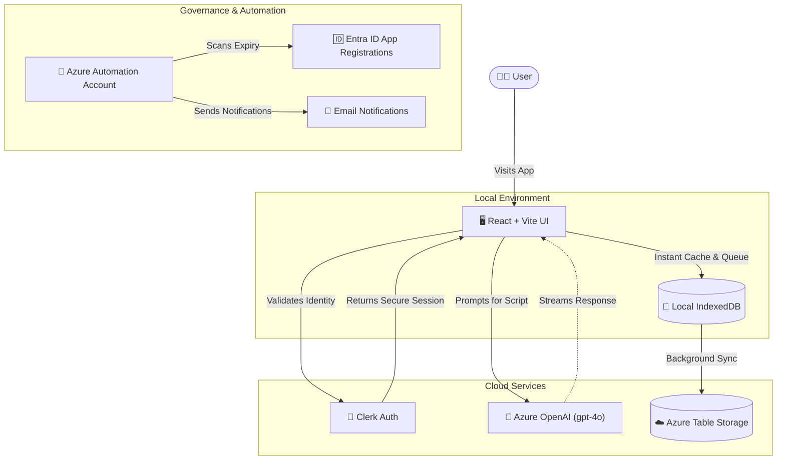
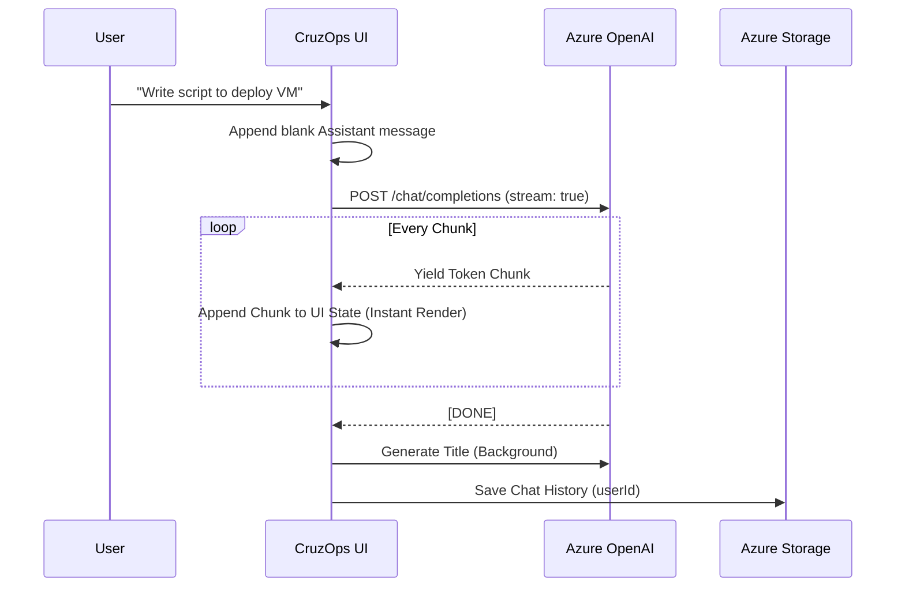

# CruzOps AI 🚀

CruzOps AI is a premium, enterprise-grade Web Application built to function as an intelligent **Azure Infrastructure Assistant**. Inspired by the UI and UX of ChatGPT and Copilot, it provides on-demand generation of **Azure PowerShell** and **Azure CLI** scripts based on conversational prompts.


## ✨ Core Features

- **Multi-Provider Authentication**: Fully secured with **Clerk** (custom themed dark-mode), allowing seamless login via Google, Microsoft, Apple, or GitHub.
- **Cross-Device Syncing**: Chat history is persistently stored in **Azure Table Storage**. Start a session on one device and resume it on any other after logging in.
- **Offline IndexedDB Sync Engine**: Full offline capabilities caching chats locally inside IndexedDB. Changes, deletions, and new chats created offline are queued and auto-synced back to Azure storage upon network reconnection.
- **Interactive Sidebar UX**: Instantly filter past histories with a fuzzy sidebar search box, and manually rename any session title inline with quick double-click/edit inputs.
- **Code Block Utilities & Downloads**: One-click download button dynamically saving scripts as `.ps1`, `.sh`, `.json`, `.kusto`, or `.md` depending on code blocks.
- **Local Script Syntax Validator**: Dry-run parsing checks unbalanced parentheses, curly braces, and quotes inside PowerShell/Bash scripts, verifying `Connect-AzAccount` configurations on the fly.
- **KQL Schema Visualizer**: Extracts projected columns (`project` / `extend` statements) from KQL queries and displays a mockup table previewing columns and sample values.
- **Markdown & PDF Exports**: Export chats to standard Markdown or print them to physical papers or formatted PDFs via customized `@media print` layout overrides.
- **Auto-Authentication**: Every generated PowerShell script automatically includes `Connect-AzAccount` for immediate usability.
- **Bot Control**: Take control of the AI with a "Stop" button to cancel generation mid-stream.
- **Message Editing**: Correct or refine your prompts easily with the in-chat edit feature.
- **Multimodal Support & Drag-and-Drop**: Attach files by clicking the attach icon or simply dragging and dropping them directly onto the input box, featuring a dynamic visual glow indicator.
- **Update Notifications**: Stay informed with an in-app banner for new versions and a "What's New" modal showcasing latest features.
- **Instant Response Streaming**: Responses are rendered instantly in real-time as chunks arrive from the server, avoiding artificial typewriter typing lags.
- **Smart Scroll Lock**: Viewport scroll-locking prevents auto-scroll from pulling you down to the bottom if you scroll up to inspect previous answers while the bot is generating.
- **Mobile Keyboard Next-Line Support**: On mobile virtual keyboards, pressing "Enter/Go" always inserts a new line (instead of triggering message submission) to prevent accidental sends. Message submission is done explicitly by clicking the Send button in the UI.
- **Enforced 3-Format Scripting**: Outputs a logical script flow, an Azure PowerShell script, Azure CLI commands, and an Azure Resource Graph (KQL) query for every request.
- **Cyberpunk Glassmorphism UI**: High-fidelity dark mode with moving ambient nebula backgrounds, translucent panels with high blur values, neon-glowing accents, and responsive micro-animations.
- **Progressive Web App (PWA)**: Fully installable as a standalone application on desktop and mobile devices.
- **Responsive Layout & Auto-Fit**: Completely optimized for all desktop, tablet, and mobile viewports with automatic horizontal overflow prevention, internal code scrolling, and wrapping of unbroken text (like raw JSON blocks).
- **Automated Secret Rotation**: Integrated Azure Automation system that monitors App Registration secrets and notifies owners at 30/15/7/1-day intervals to prevent service outages.

## 🛠️ Tech Stack

| Technology | Icon | Version | Description |
| :--- | :---: | :--- | :--- |
| **React** |  | `v19.2.6` | Core frontend library for building the UI. |
| **Vite** |  | `v8.0.12` | Next-generation frontend tooling and bundler. |
| **Clerk & Themes**|  | `v5.61.6` / `v2.4.57` | Identity management with dark theme integrations. |
| **Azure Storage** |  | `v13.3.2` | Persistent, scalable chat history storage. |
| **OpenAI (Azure)** |  | `v6.37.0` | GPT-4o powered script generation and vision analysis. |
| **Lucide Icons** |  | `v1.14.0` | Premium, consistent iconography throughout the app. |
| **PWA** |  | `v1.3.0` | Enables offline support and mobile installability. |

## 🏗️ Architecture & Data Flow

CruzOps AI leverages a modern React frontend with direct, secure integrations to Azure cloud services. 



### 🔄 Automated Secret Monitoring
To maintain 100% uptime, the project includes an **Azure Automation** layer that monitors the health of App Registration secrets.
- **Workflow**: A PowerShell runbook (`Check-AppExpiry`) runs daily.
- **Identity**: Authenticates securely via a **System-Assigned Managed Identity**.
- **Notification Thresholds**: Emails are automatically sent to `Anto13franc@outlook.com` and `sasafiyullah@outlook.com` at **30, 15, 7, and 1-day** intervals before any secret expires.
- **Scope**: Scans all App Registrations within the tenant to ensure global governance.

### Authentication Flow
1. User visits `CruzOps AI`.
2. App checks for active Clerk session. If none, user is blocked by `<SignIn />` wall.
3. User logs in (e.g., via Google). Clerk returns a globally unique `user_id`.
4. App initializes the Azure Storage client using the SAS token and queries the `PartitionKey` matching the `user_id`.

### AI Streaming Flow


## 📂 Project Tree Structure

```text
cruzops-ai/
├── index.html                 # Main HTML Entry Point
├── package.json               # NPM Dependencies
├── vite.config.js             # Vite & PWA Configuration
├── .env                       # Environment Variables (OpenAI & Azure Storage)
├── .gitignore                 # Protected Secrets
├── README.md                  # This File
├── public/
│   ├── logo.svg               # CruzOps AI Vector Logo
│   ├── pwa-192x192.png        # PWA Icon
│   └── pwa-512x512.png        # PWA Icon
└── src/
    ├── main.jsx               # React Root & ClerkProvider Wrapper
    ├── App.jsx                # Core Chat UI, Sidebar & Streaming Logic
    ├── index.css              # Glassmorphism Dark Mode Styling
    ├── services/
    │   ├── azureStorage.js    # Azure Table Storage Sync Logic
    │   └── indexedDB.js       # Offline Caching Database & Queue Sync Logic
    └── automation/            # Cloud Governance Scripts
        ├── Check-AppExpiry.ps1 # PowerShell Runbook for Secret Monitoring
        └── README.md          # Automation Setup Guide
```

## 🚀 Getting Started

1. **Clone & Install Dependencies**
   ```bash
   git clone <repo-url>
   cd cruzops-ai
   npm install
   ```

2. **Configure Environment Variables**
   Create a `.env` file and populate it with your credentials:
   ```env
   VITE_AZURE_OPENAI_ENDPOINT=https://<your-resource>.openai.azure.com/
   VITE_AZURE_OPENAI_API_KEY=<your-key>
   VITE_AZURE_OPENAI_DEPLOYMENT_NAME=gpt-4o
   VITE_AZURE_STORAGE_SAS_URL=https://<account>.table.core.windows.net/ChatHistory?<sas-token>
   VITE_CLERK_PUBLISHABLE_KEY=pk_test_...
   ```

3. **Run Development Server**
   ```bash
   npm run dev
   ```
