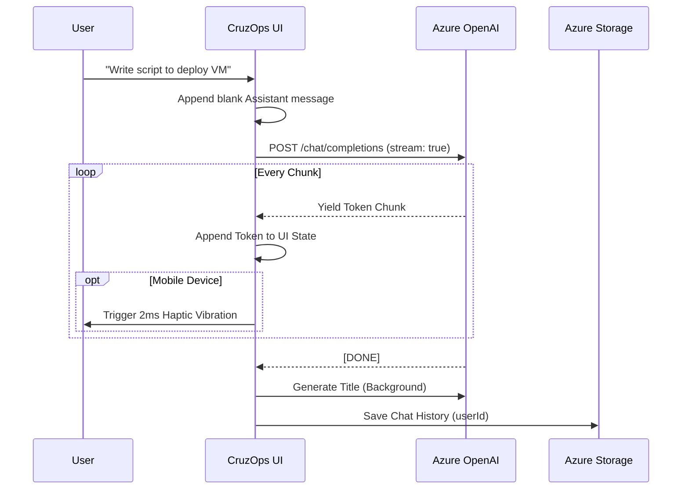

# CruzOps AI 🚀

CruzOps AI is a premium, enterprise-grade Web Application built to function as an intelligent **Azure Infrastructure Assistant**. Inspired by the UI and UX of ChatGPT and Copilot, it provides on-demand generation of **Azure PowerShell** and **Azure CLI** scripts based on conversational prompts.


## ✨ Core Features

- **Multi-Provider Authentication**: Fully secured with **Clerk**, allowing seamless login via Google, Microsoft, Apple, or GitHub.
- **Cross-Device Syncing**: Chat history is persistently stored in **Azure Table Storage** using your unique authenticated ID, meaning you can start a chat on your laptop and finish it on your phone.
- **Real-Time Streaming**: AI responses are streamed directly to the UI character-by-character for a fast, premium feel.
- **Mobile Haptics**: Features subtle device vibrations (`navigator.vibrate`) that simulate mechanical typing on supported mobile devices during text generation.
- **Auto-Titling**: Automatically generates a concise 3-word summary of your prompt to title your chat sessions in the sidebar.
- **Progressive Web App (PWA)**: Fully installable as a standalone application on desktop and mobile devices.

## 🏗️ Architecture & Data Flow

CruzOps AI leverages a modern React frontend with direct, secure integrations to Azure cloud services. 

```mermaid
graph TD
    User([👨‍💻 User]) --> |Visits App| UI[🖥️ React + Vite UI]
    UI --> |Validates Identity| Clerk[🔐 Clerk Auth]
    Clerk --> |Returns Secure Session| UI
    
    UI --> |Prompts for Script| OpenAI[🧠 Azure OpenAI (gpt-4o)]
    OpenAI -.-> |Streams Response| UI
    
    UI --> |Background Sync| TableStorage[(☁️ Azure Table Storage)]
    
    subgraph "Local Environment"
        UI
    end
    
    subgraph "Cloud Services"
        Clerk
        OpenAI
        TableStorage
    end
```

### Authentication Flow
1. User visits `CruzOps AI`.
2. App checks for active Clerk session. If none, user is blocked by `<SignIn />` wall.
3. User logs in (e.g., via Google). Clerk returns a globally unique `user_id`.
4. App initializes the Azure Storage client using the SAS token and queries the `PartitionKey` matching the `user_id`.

### AI Streaming Flow


## 📂 Project Tree Structure

```text
cruzops-ai/
├── index.html                 # Main HTML Entry Point
├── package.json               # NPM Dependencies
├── vite.config.js             # Vite & PWA Configuration
├── .env                       # Environment Variables (OpenAI & Azure Storage)
├── .gitignore                 # Protected Secrets
├── README.md                  # This File
├── public/
│   ├── logo.svg               # CruzOps AI Vector Logo
│   ├── pwa-192x192.png        # PWA Icon
│   └── pwa-512x512.png        # PWA Icon
└── src/
    ├── main.jsx               # React Root & ClerkProvider Wrapper
    ├── App.jsx                # Core Chat UI, Sidebar & Streaming Logic
    ├── index.css              # Glassmorphism Dark Mode Styling
    └── services/
        └── azureStorage.js    # Azure Table Storage Sync Logic
```

## 🚀 Getting Started

1. **Clone & Install Dependencies**
   ```bash
   git clone <repo-url>
   cd cruzops-ai
   npm install
   ```

2. **Configure Environment Variables**
   Create a `.env` file and populate it with your credentials:
   ```env
   VITE_AZURE_OPENAI_ENDPOINT=https://<your-resource>.openai.azure.com/
   VITE_AZURE_OPENAI_API_KEY=<your-key>
   VITE_AZURE_OPENAI_DEPLOYMENT_NAME=gpt-4o
   VITE_AZURE_STORAGE_SAS_URL=https://<account>.table.core.windows.net/ChatHistory?<sas-token>
   VITE_CLERK_PUBLISHABLE_KEY=pk_test_...
   ```

3. **Run Development Server**
   ```bash
   npm run dev
   ```

## 🛠️ Tech Stack
- **Frontend Framework**: React 19, Vite
- **Styling**: Vanilla CSS (Glassmorphism, CSS Variables)
- **Authentication**: Clerk (`@clerk/clerk-react`)
- **Database**: Azure Table Storage (`@azure/data-tables`)
- **AI Integration**: Azure OpenAI SDK (`openai`)
- **Markdown & Syntax**: `react-markdown`, `react-syntax-highlighter`
- **Icons**: Lucide React
